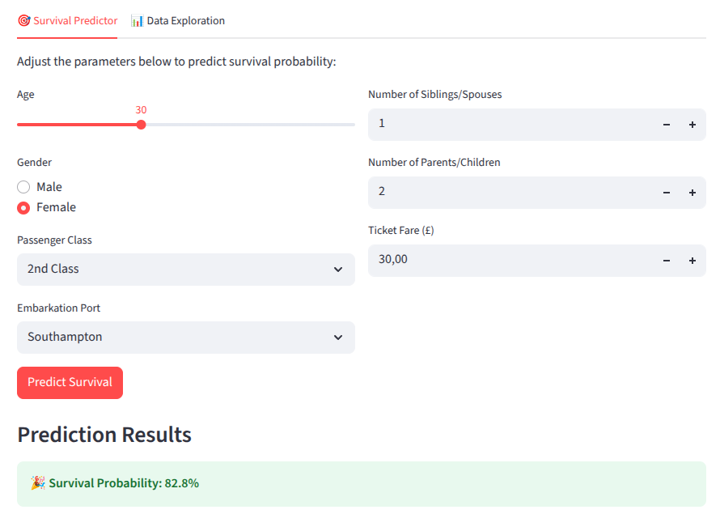
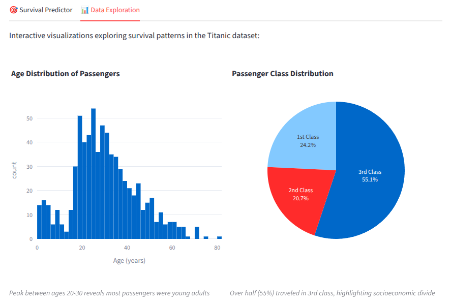

# Survival Probability Simulator

The Survival Probability Simulator is an interactive data science application that leverages machine learning to predict passenger survival probability based on the historic Titanic dataset. This educational and analytical tool combines comprehensive exploratory data analysis with predictive modeling, delivering insights through an intuitive web interface built with Streamlit.

## Features

### 🎯 Interactive Survival Predictor
- **Real-time Predictions**: Adjust passenger characteristics using intuitive input controls
- **Machine Learning Model**: Trained Random Forest classifier with ~86% accuracy
- **Visual Feedback**: Celebratory animations for high survival probabilities (>50%)
- **Contextual Insights**: Risk assessment based on prediction results



### 📊 Comprehensive Data Exploration Gallery
- **15 Interactive Visualizations**: Complete exploratory data analysis with hover tooltips and zoom capabilities
- **Historical Insights**: Each chart includes expert commentary on survival patterns
- **Performance Optimized**: Cached data loading and efficient rendering
- **Responsive Design**: Works seamlessly across desktop and mobile devices



## Try the App
You can try the app online at Streamlit Community Cloud [here](https://survival-probability-simulator.streamlit.app/).


## Installation

### Prerequisites
- Python 3.12 or higher
- pip package manager

### Local Setup

1. **Clone the repository**
   ```bash
   git clone https://github.com/your-username/survival-probability-simulator.git
   cd survival-probability-simulator
   ```

2. **Create and activate virtual environment**
   ```bash
   python -m venv venv
   
   # On Windows
   venv\Scripts\activate
   
   # On macOS/Linux  
   source venv/bin/activate
   ```

3. **Install dependencies**
   ```bash
   pip install -r requirements.txt
   ```

4. **Run the application**
   ```bash
   streamlit run app.py
   ```

5. **Access the app**
   Open your browser and navigate to `http://localhost:8501`

## Docker Guide

The Survival Probability Simulator is available as a pre-built Docker image on Docker Hub: [marcoom/survival-probability-simulator](https://hub.docker.com/r/marcoom/survival-probability-simulator)

### Building the Docker Image
```bash
docker build -t titanic-survival-simulator .
```

### Running the Container
```bash
docker run -p 8501:8501 titanic-survival-simulator
```

### Accessing the Application
Once the container is running, access the application at `http://localhost:8501`

The Docker setup includes:
- Optimized Python 3.12-slim base image
- Non-root user for enhanced security
- Health checks for container monitoring
- Efficient layer caching for faster builds

## Usage

### Tab 1: Survival Predictor
1. **Adjust Parameters**: Use the intuitive controls to set passenger characteristics:
   - Age (slider: 0.42-80 years)
   - Gender (radio buttons: Male/Female)  
   - Passenger Class (dropdown: 1st, 2nd, 3rd)
   - Embarkation Port (dropdown: Southampton, Cherbourg, Queenstown)
   - Family Information (number inputs for siblings/spouses and parents/children)
   - Ticket Fare (number input: £0-512.33)

2. **Get Predictions**: Click "Predict Survival" to receive instant probability assessment
3. **Celebrate**: High survival probabilities (>50%) trigger celebratory animations
4. **Interpret Results**: Contextual risk assessment helps understand the prediction

### Tab 2: Data Exploration  
Explore 15 comprehensive visualizations covering:
- **Demographics**: Age distribution, gender ratios, class proportions
- **Survival Analysis**: Feature importance, survival rates by various factors
- **Advanced Insights**: Correlation analysis, multi-dimensional patterns
- **Interactive Features**: Hover for exact values, zoom for detailed exploration

## Scripts

### `preprocess_data.py`
Cleans and preprocesses the raw Titanic dataset for model training and visualization.

**Key Operations**:
- Handles missing values with group-based median imputation
- Removes outliers using 3-standard-deviation rule
- Engineers features (child flag, one-hot encoding)
- Applies appropriate scaling (custom age, MinMax for siblings/parents, StandardScaler for fare)
- Saves processed data to `data/titanic_processed.parquet`

**Usage**: `python scripts/preprocess_data.py`

### `train_model.py`
Trains the Random Forest model using the processed dataset and saves complete pipeline.

**Key Operations**:
- Creates sklearn Pipeline with preprocessing and Random Forest classifier
- Uses optimized hyperparameters (n_estimators=1000, max_depth=9, etc.)
- Evaluates model performance and displays metrics
- Saves complete pipeline to `model/titanic_model_pipeline.joblib`

**Usage**: `python scripts/train_model.py`

**Note**: These scripts are provided for reference and reproducibility. The processed data (`titanic_processed.parquet`) and trained model (`titanic_model_pipeline.joblib`) are already included in the repository. The raw dataset (`titanic_raw.csv`) is the official Kaggle Titanic competition dataset.

**Execution Order** (if rebuilding from scratch):
1. First run `preprocess_data.py` to generate processed data
2. Then run `train_model.py` to train and save the model

## Project Structure

```
survival-probability-simulator/
├── app.py                           # Main Streamlit application
├── CLAUDE.md                        # Development guidance for Claude Code
├── CONTRIBUTING.rst                 # Contribution guidelines
├── data/                           # Dataset storage
│   ├── titanic_raw.csv             # Original Kaggle Titanic dataset
│   └── titanic_processed.parquet   # Cleaned and feature-engineered data
├── docs/                           # Project documentation  
│   └── PRD.md                      # Complete product requirements document
├── Dockerfile                       # Container configuration
├── LICENSE                         # MIT license
├── MANIFEST.in                     # Package manifest
├── media/                          # Screenshots and media assets
├── model/                          # Trained model storage
│   └── titanic_model_pipeline.joblib  # Complete sklearn pipeline
├── notebooks/                      # Jupyter analysis notebooks
│   └── titanic-survival-prediction.ipynb  # EDA and modeling reference
├── README.md                       # Project overview and setup guide
├── requirements.txt                # Python dependencies
├── scripts/                        # Data processing and model training
│   ├── preprocess_data.py          # Data cleaning and feature engineering
│   └── train_model.py              # Model training and pipeline creation
└── SECURITY.md                     # Security guidelines
```

## Data Dictionary

| Feature | Type | Range | Description |
|---------|------|-------|-------------|
| survived | float | 0, 1 | Target variable (0=died, 1=survived) |
| age_scaled | float | 0-1 | Age normalized to 0-122 range |
| male | float | 0, 1 | Binary gender indicator (1=male, 0=female) |
| child | float | 0, 1 | Binary indicator for age ≤ 15 |
| fare_scaled | float | ~-2 to ~10 | Standardized ticket fare |
| class_First | float | 0, 1 | One-hot encoded 1st class |
| class_Second | float | 0, 1 | One-hot encoded 2nd class |
| class_Third | float | 0, 1 | One-hot encoded 3rd class |
| sibsp_scaled | float | 0-1 | MinMax scaled siblings/spouses count |
| parch_scaled | float | 0-1 | MinMax scaled parents/children count |
| embark_town_Cherbourg | float | 0, 1 | One-hot encoded Cherbourg embarkation |
| embark_town_Queenstown | float | 0, 1 | One-hot encoded Queenstown embarkation |
| embark_town_Southampton | float | 0, 1 | One-hot encoded Southampton embarkation |

## Model Performance

### Random Forest Classifier Metrics
- **Accuracy**: ~86%
- **Hyperparameter Optimization**: GridSearchCV with 3-fold cross-validation
- **Model Configuration**:
  - 1000 decision trees (n_estimators=1000)
  - Maximum depth: 9 levels
  - Bootstrap sampling enabled
  - Feature subsampling: 20% per tree
  - Sample subsampling: 20% per tree

### Feature Importance (Top Contributors)
1. **Fare**: Ticket price - strongest predictor of survival
2. **Gender (Male)**: Male passengers had significantly lower survival rates
3. **Age**: Younger passengers, especially children, had higher survival rates
4. **Passenger Class**: First-class passengers had better survival odds
5. **Embarkation Port**: Cherbourg passengers (wealthier) had higher survival rates

### Key Insights
- **Wealth Factor**: Higher ticket fares strongly correlated with survival
- **"Women and Children First"**: Clear gender and age bias in rescue protocol
- **Class Distinction**: Socioeconomic status significantly impacted survival odds
- **Port Influence**: Embarkation port served as proxy for passenger wealth

## Contributing

We welcome contributions to improve the Survival Probability Simulator! Please review our contribution guidelines in `CONTRIBUTING.rst` for detailed information on:

- Code style requirements (PEP 8 compliance)
- Documentation standards (PEP 257 docstrings)
- Pull request process
- Issue reporting guidelines

## License

This project is licensed under the **MIT License** — you are free to use, modify, and distribute it, with attribution. See the LICENSE file for details.

---

**Built with**: Python • Streamlit • Scikit-learn • Plotly • Pandas • NumPy

**Dataset**: Historic Titanic passenger data from Kaggle competition
